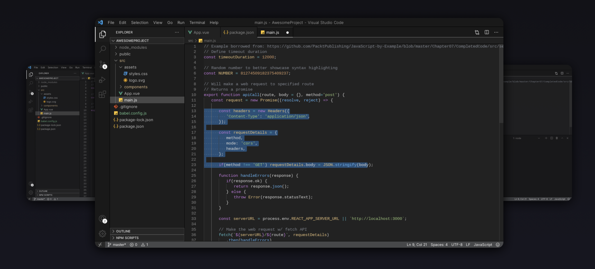
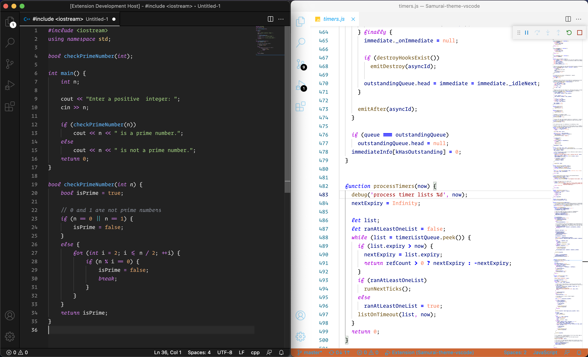
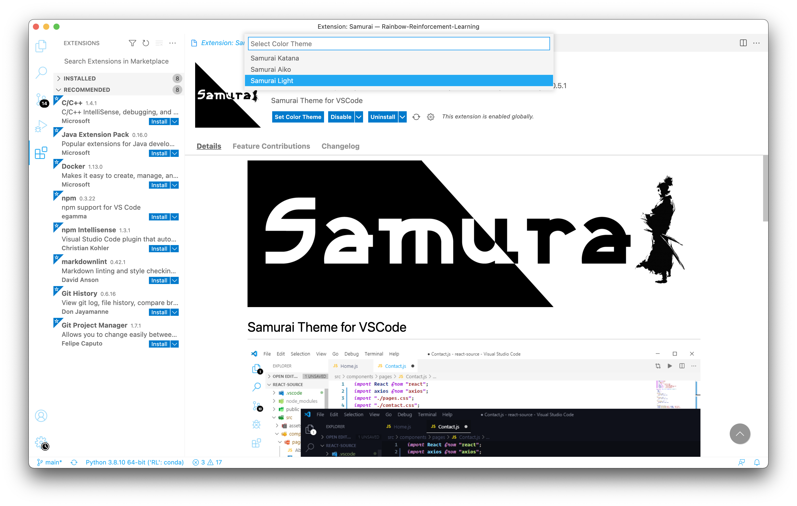
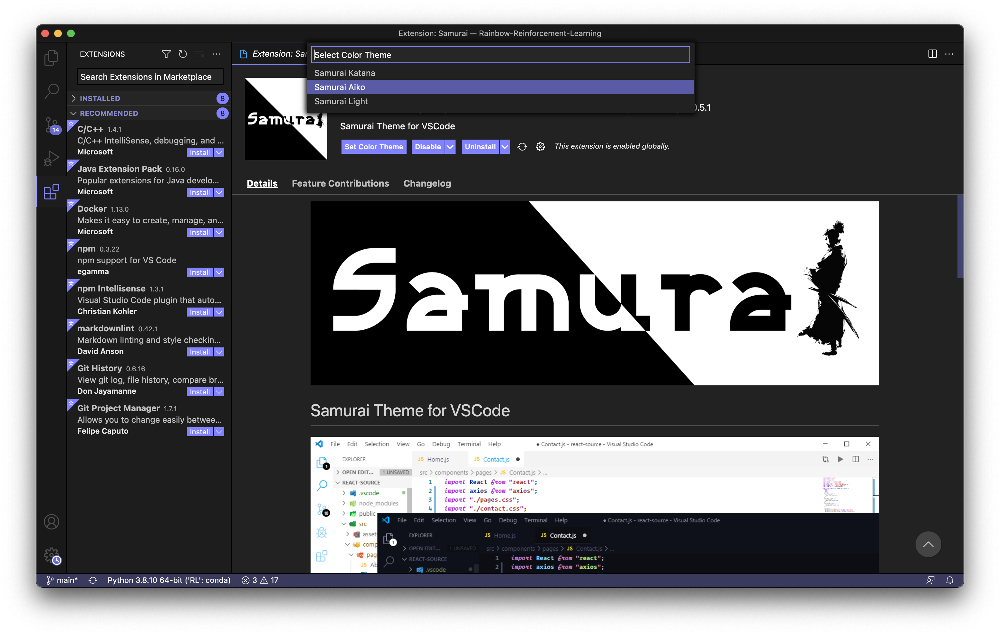
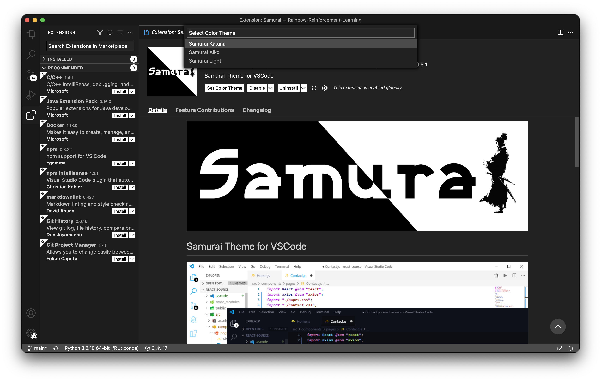

# Samurai Theme for Visual Studio Code





## Light


## Aiko


## Katana



## Installation
1. Open Extensions sidebar panel and search for ``` Samurai ``` by **Parsa Samadnejad**
2. Click Install and then Reload your editor.
3. Manage > Color Theme > ```Samurai Katana``` / ```Samurai Light```

* [MarketPlace](https://marketplace.visualstudio.com/items?itemName=ParsaSam.samurai)

## Recommended Settings
### Operator Mono Font (Paid) & Operator Mono Ligatures
```
// User/Settings.json

{
  "workbench.colorTheme": "Samurai Katana",
  "editor.fontFamily": "Operator Mono",
  "editor.fontLigatures": true
}
```
* Font: [Operator Mono Font](https://www.typography.com/fonts/operator/styles)
* Ligatures: [Operator Mono Ligatures](https://github.com/kiliman/operator-mono-lig)


### Operator Mono Font (Free Version) without Ligatures
```
// User/Settings.json

{
  "workbench.colorTheme": "Samurai Katana",
  "editor.fontFamily": "'Operator Mono'",
  "editor.fontLigatures": false
}
```
* Font: [Operator Mono Font](https://www.cufonfonts.com/font/operator-mono)

## Contributing

Please read [CONTRIBUTING](CONTRIBUTING.md).

## License

This project is licensed under the [MIT License](LICENSE).
